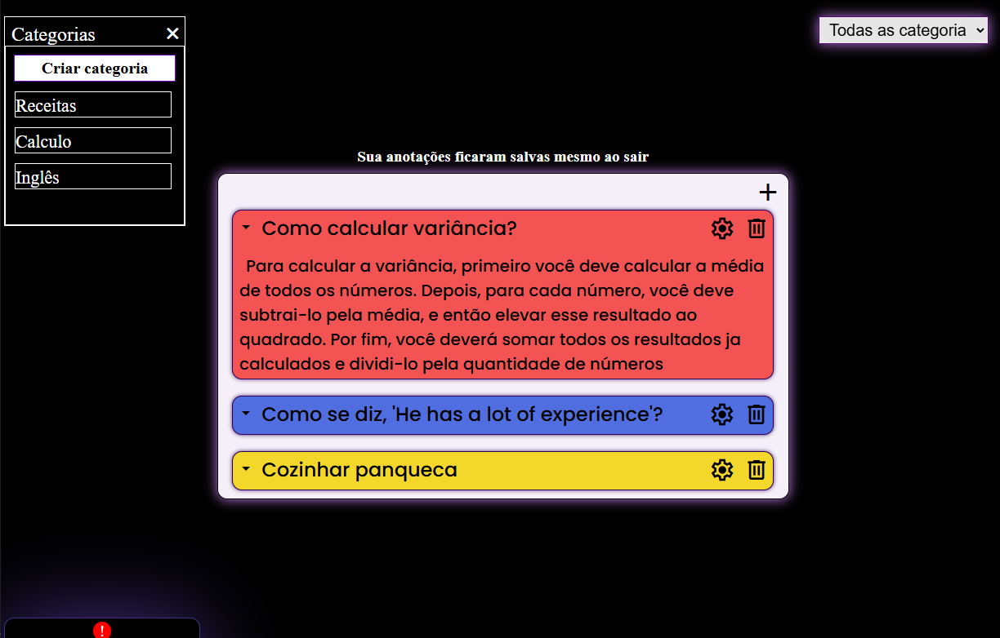

# Flash Cards

## O que é?
 Este é um projeto com foco único e exclusivo na agilidade e praticidade para criar FlashCards. Possui um sistema simplificado para separar anotações em categorias.
- Flash Cards são anotações simples, que possuem um cabeçalho e um corpo. O cabaçalho pode ser usado como pergunta, título de um tema, ou recordação. O corpo do Flash Card é utilizado para responder uma pergunta, descrever um tema, descrever uma situação, criar uma recordação, etc.

## Como o site funciona?
 O site simula um CRUD (**Create, Read, Update e Delete**), porém, sem banco de dados. Todos os dados são armazenados no navegador do usuário através do recurso **LocalStorage**. Os dados são armazenados como um objeto, facilitando a manipulação dos dados.

## Tecnologias usadas
- HTML
- CSS
- JS

## Acessar projeto
- [Clique aqui para acessar o projeto](https://joelribeirod.github.io/html-css/Tentativas/Tentativa06/index.html)

## Funcionalidades
- Criar anotações (FlashCards)
- Editar anotações
- Excluir anotações
- Organizar anotações por categorias
- Armazenamento local via **LocalStorage**

## Visual
### Anotações

### Relacionando Anotações com categorias

### Adicionar FlashCards

### Div central

### Aviso de LocalStorage
- Avisando para o usuário que suas anotações ficam salvas naquele navegador, naquele dispositivo

### Criar e manipular categorias

### Filtrar anotações através das categorias
